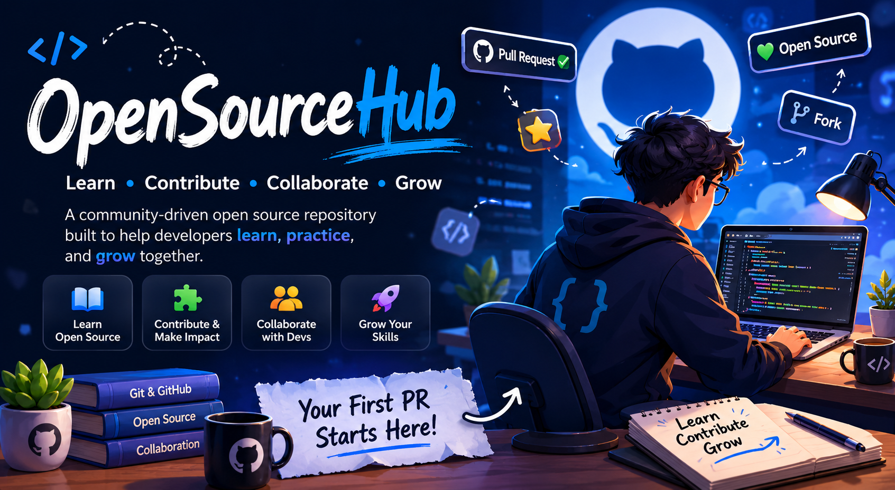

# OpenSourceHub 🚀

### Learn • Contribute • Collaborate • Grow

A community-driven open source repository built to help developers start their journey in Open Source and improve their real-world development skills.

  
  
  
  

---

## 📌 About The Project

OpenSourceHub is an educational and collaborative platform designed for developers who want to learn, practice, and contribute to Open Source projects in a beginner-friendly environment.

The repository aims to simplify the Open Source journey by providing organized learning resources, contribution opportunities, practical projects, and community-driven educational content.

Whether you are making your first Pull Request or helping others grow, this repository is built for you.

---

## 🎯 Purpose Of This Repository

This repository was created to help developers:

- Understand how Open Source works
- Learn Git & GitHub workflows
- Practice collaboration in real projects
- Make their first contributions confidently
- Share knowledge with the community
- Improve problem-solving and teamwork skills
- Build strong developer portfolios

---

## 🌟 What You Will Find Here

- 📚 Open Source learning guides
- 💻 Beginner-friendly projects
- 🎓 Community-created courses
- 🛠 Practice and contribution opportunities
- 🤝 Collaborative learning environment
- 👥 Contributor recognition
- 📖 Developer resources and roadmaps

---

## 🌍 Community Driven

OpenSourceHub grows through community contributions.

Anyone can contribute by:

- Adding projects
- Creating courses
- Improving documentation
- Fixing issues
- Sharing resources
- Helping beginners

Every contribution matters and helps other developers learn and grow.

---

## 🚀 Our Vision

To build one of the most beginner-friendly Open Source communities where developers can learn together, collaborate on meaningful projects, and gain real-world contribution experience.

---

## 🤝 Contributions

Contributions are always welcome.

If you want to contribute, please check the contribution guidelines inside:

[CONTRIBUTING.md](./CONTRIBUTING.md)
