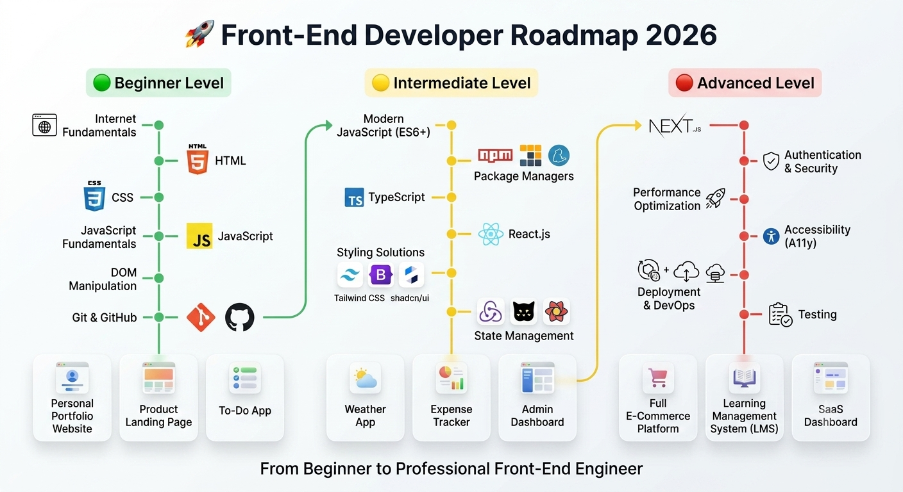

# 🚀 Front-End Developer Roadmap

A complete roadmap to become a professional Front-End Developer.

---

# 🟢 Beginner Level

## 🌐 Internet Fundamentals

### Topics

- How the Internet Works
- HTTP & HTTPS
- DNS
- Domain Names
- Hosting
- Browsers
- Client-Server Architecture

## 📝 HTML

### Topics

- HTML Elements
- Semantic HTML
- Forms
- Tables
- Multimedia
- Accessibility Basics

## 🎨 CSS

### Topics

- Selectors
- Box Model
- Display
- Positioning
- Flexbox
- CSS Grid
- Responsive Design
- Media Queries
- Animations
- Transitions

## ⚡ JavaScript Fundamentals

### Topics

- Variables
- Data Types
- Operators
- Functions
- Arrays
- Objects
- Loops
- Scope
- Closures
- Error Handling

### DOM & Browser APIs

- DOM Manipulation
- Events
- Event Delegation
- Local Storage
- Session Storage

## 🔧 Git & GitHub

### Topics

- Git Basics
- Branches
- Merging
- Pull Requests
- GitHub Workflow

---

# 🏆 Beginner Projects

### Personal Portfolio Website

- Responsive Design
- Modern Layout
- Personal Branding

### Product Landing Page

- Flexbox
- CSS Grid
- Responsive Design

### Calculator App

- DOM Manipulation
- JavaScript Events

### To-Do App

- CRUD Operations
- Local Storage

### Multi-Page Business Website

- Navigation
- Forms
- Responsive Layout

---

# 🟡 Intermediate Level

## ⚡ Modern JavaScript

### ES6+

- Arrow Functions
- Template Literals
- Destructuring
- Spread Operator
- Rest Parameters
- Modules

### Asynchronous JavaScript

- Promises
- Async/Await
- Fetch API
- Error Handling

## 📦 Package Managers

### Learn

- npm
- pnpm
- yarn

### Topics

- Installing Packages
- Scripts
- Dependency Management

## 🔷 TypeScript

### Topics

- Types
- Interfaces
- Enums
- Generics
- Utility Types

## ⚛️ React.js

### Fundamentals

- Components
- JSX
- Props
- State
- Hooks

### Advanced React

- Forms
- Routing
- API Integration
- Custom Hooks
- Context API

## 🎨 Styling Solutions

### CSS Frameworks

- Tailwind CSS
- Bootstrap

### UI Libraries

- shadcn/ui
- Material UI
- Chakra UI

## 🗄️ State Management

### Topics

- Context API
- Redux Toolkit
- Zustand
- TanStack Query

---

# 🏆 Intermediate Projects

### Weather Application

- API Integration
- Search Functionality

### Expense Tracker

- State Management
- CRUD Operations

### Blog Platform

- Authentication
- Forms
- Routing

### Admin Dashboard

- Analytics
- Charts
- Responsive Layout

---

# 🔴 Advanced Level

## ▲ Next.js

### Topics

- App Router
- Server Components
- Client Components
- Dynamic Routing
- Metadata API
- Dynamic SEO
- Dynamic Open Graph Images
- Server Actions
- Middleware

## 🔐 Authentication & Security

### Topics

- JWT
- Cookies
- Sessions
- OAuth
- Protected Routes

## ⚡ Performance Optimization

### Topics

- Lazy Loading
- Code Splitting
- Image Optimization
- Memoization
- Lighthouse Audits

## ♿ Accessibility (A11y)

### Topics

- Semantic HTML
- ARIA Attributes
- Keyboard Navigation
- Screen Readers

## 🚀 Deployment & DevOps

### Platforms

- Vercel
- Netlify
- GitHub Pages

### Topics

- Environment Variables
- CI/CD
- Production Builds

## 🧪 Testing

### Topics

- Jest
- React Testing Library
- Playwright
- Unit Testing
- Integration Testing
- E2E Testing

---

# 🏆 Advanced Projects

### Full E-Commerce Platform

- Authentication
- Shopping Cart
- Checkout
- Dynamic SEO
- Dynamic Open Graph

### Learning Management System (LMS)

- Courses
- Video Lessons
- Progress Tracking
- User Roles

### SaaS Dashboard

- Analytics
- Authentication
- Subscription Plans

### Real-Time Chat Application

- WebSockets
- Notifications
- Online Status

### Enterprise Management System

- Multi-Role Authentication
- Reports
- Dashboards

---

# 📚 Additional Resources

## Documentation

- MDN Web Docs
- JavaScript.info
- TypeScript Documentation
- React Documentation
- Next.js Documentation
- Tailwind CSS Documentation

## Practice Platforms

- Frontend Mentor
- CodeWars
- LeetCode
- HackerRank

---

# 🎯 Final Goal

After completing this roadmap, you should be able to:

- Build responsive websites
- Create scalable React applications
- Develop production-ready Next.js applications
- Work with APIs
- Implement Authentication
- Optimize Performance
- Deploy Professional Applications
- Contribute to Open Source

---

# ⏳ Estimated Timeline

| Level | Duration |
|---------|---------|
| 🟢 Beginner | 2–3 Months |
| 🟡 Intermediate | 3–5 Months |
| 🔴 Advanced | 4–6 Months |

**Total:** 9–14 Months

Happy Coding! 🚀
