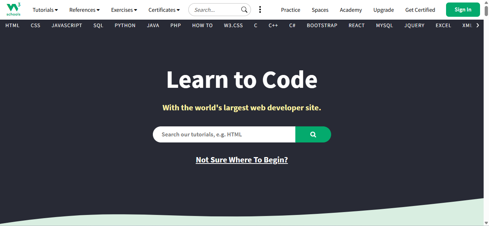

# W3Schools 🌐

  

## Overview

**W3Schools** is one of the most popular online learning platforms for web development and programming. It provides beginner-friendly tutorials, interactive examples, quizzes, and exercises that help developers learn by doing.

The platform covers a wide range of technologies used in modern software development, making it an excellent starting point for students and self-taught developers.

## What You Can Learn

### Frontend Development
- HTML
- CSS
- JavaScript
- Bootstrap
- React
- Angular

### Backend Development
- PHP
- Node.js
- SQL
- MySQL

### Programming Languages
- Python
- Java
- C
- C++
- C#
- Kotlin
- Go

### Data Science & AI
- Python for Data Science
- NumPy
- Pandas
- Machine Learning Basics

### Web Technologies
- REST APIs
- JSON
- XML
- HTTP
- Web Security

## Why Use W3Schools?

✅ Beginner-friendly explanations

✅ Interactive code editor

✅ Hands-on exercises and quizzes

✅ Covers a large number of technologies

✅ Free access to most learning materials

✅ Quick reference guides and documentation

## Best For

- Beginners starting their programming journey
- Students learning web development
- Developers looking for quick references
- Anyone wanting to practice code directly in the browser

## Tips for Learning

1. Start with HTML and CSS.
2. Move on to JavaScript fundamentals.
3. Practice every example using the online editor.
4. Complete quizzes and exercises after each topic.
5. Build small projects to reinforce your knowledge.

## Website

https://www.w3schools.com/

## Resource Type

- Learning Platform
- Interactive Tutorials
- Documentation
- Practice Exercises

## License

The content belongs to W3Schools. Please visit the official website for the latest tutorials and learning materials.
