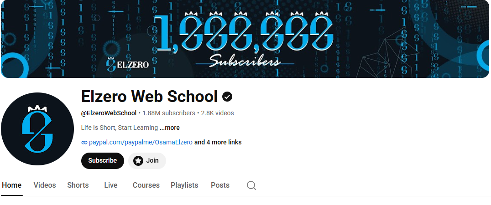
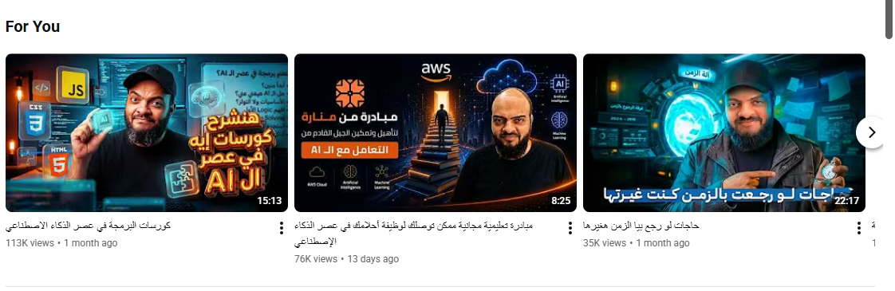
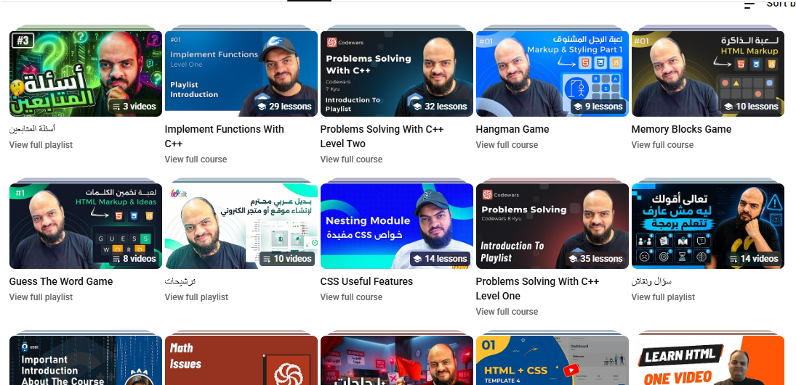

# Elzero Web School

## Overview
Elzero Web School is one of the most popular Arabic programming education channels on YouTube.

## Channel Screenshots

## Channel Information

- Founder: Osama Elzero
- Language: Arabic
- Category: Programming & Web Development
- Level: Beginner to Advanced

## Topics Covered

- HTML
- CSS
- JavaScript
- TypeScript
- React
- Next.js
- PHP
- Laravel
- Python
- Git & GitHub
- Data Structures & Algorithms
- Problem Solving

## YouTube Channel

https://www.youtube.com/@ElzeroWebSchool
